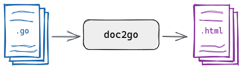
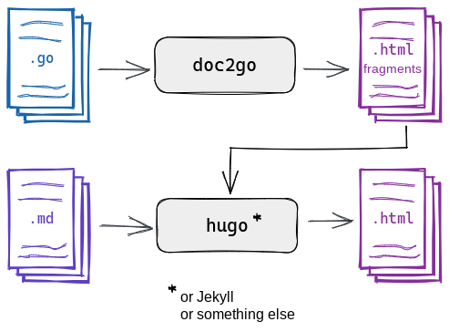

## What is doc2go?

doc2go is a tool to generate API documentation from Go source code.
It takes your Go source code,
and generates a static HTML website from it.

### Embedded mode

doc2go additionally supports an **embedded mode**.

In this mode, it generates *fragments* of HTML instead of a whole website.
You can feed this output into a static website generator
like [Hugo]() or Jekyll
and make doc2go's output part of a bigger website.

## Why should I use it?

You should use doc2go if you're a **library maintainer**
with one of the following needs:

* self-hosting documentation for your packages
* distributing documentation with your software
* deploying the API reference alongside your user guide
* branding your documentation

You should use doc2go if you're a **library user**
who wants to keep offline copies of documentation for libraries that you use.

### Non-goals

doc2go does not aim to
introduce new syntax to the Go documentation comments.
All documentation processed by doc2go must remain valid,
as defined by the official Go documentation tooling.

## How does it look?

To get an idea of how the output looks,
check out the following links:



{}
A documentation website generated from doc2go's own source code
is available [here](../example/).
{}

{}
A copy of the same documentation embedded into this website
is available [here](../api/).
{}


