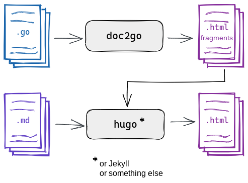

This section covers how to feed the output of doc2go
into static site generators
so that your API reference is embedded into a larger website.



Typically, you need the following flags for embedding:

`-embed`
: This enables the embedding behavior.
  Instead of generating a standalone website
  with its own `<html>` tag and static assets,
  doc2go will generate just the content.

[`-frontmatter`]()
: Many static site generators expect YAML or TOML front matter
  at the top of each file.
  You'll need to craft a front matter template
  specifically for your static site generator and theme.
  See the [section on front matter]()
  to learn how you can craft your own templates.

[`-basename`]()
: Some static site generators expect index files inside directories
  to be named something other than `index.html`.
  Use this flag to change the name for index files.
  For example, [Hugo]() expects `_index.html`
  so you'll use `-basename _index.html`.

## Syntax highlighting with CSS

If you're embedding your documentation into another website with `-embed`,
doc2go will default to generating
[syntax highlighting]()
instructions inline as `style="..."` attributes on HTML elements.
For example:

```html
<span style="color:#eee">/* This is a comment. */</span>
```

This requires the least amount of setup from you.

However, for large websites intended to be maintained long-term
it is recommended to use class-based syntax highlighting
that relies on CSS style sheets for style instructions.
For example:

```html
<span class="c">/* This is a comment. */</span>
```

```css
.chroma .c { color: #eee; }
```

#### Steps

You can use `classes` mode in embedded websites
if you include the theme's style sheet
into your page layout.

The steps to do so are as follows:

1. Select the `classes` mode with the `-highlight` flag.

    ```bash
    # Use the default theme:
    doc2go -highlight classes: -embed ./...

    # Use a specific theme:
    doc2go -highlight classes:monokai -embed ./...
    ```

2. Get a copy of the theme's style sheet by running
   doc2go with the `-highlight-print-css` flag.

    ```bash
    # Get the default theme's style sheet:
    doc2go -highlight-print-css > highlight.css

    # Get a specific theme's style sheet:
    doc2go -highlight dracula -highlight-print-css > highlight.css
    ```

3. Edit your website's layout to include this style sheet
   with a `<link>` tag.

    ```html
    <link href="/css/highlight.css" rel="stylesheet">
    ```

Alternatively, in step 2,
append the theme's style sheet into your website's existing CSS
and skip step 3.

```bash
doc2go -highlight-print-css >> static/css/style.css
```
